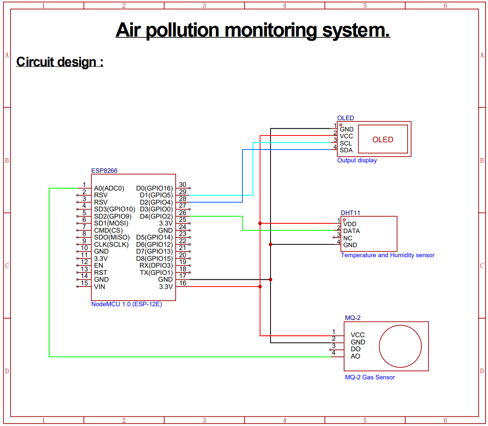
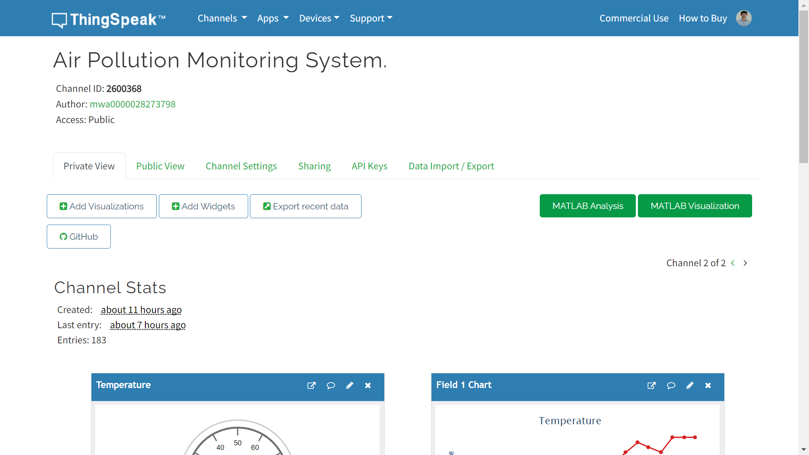
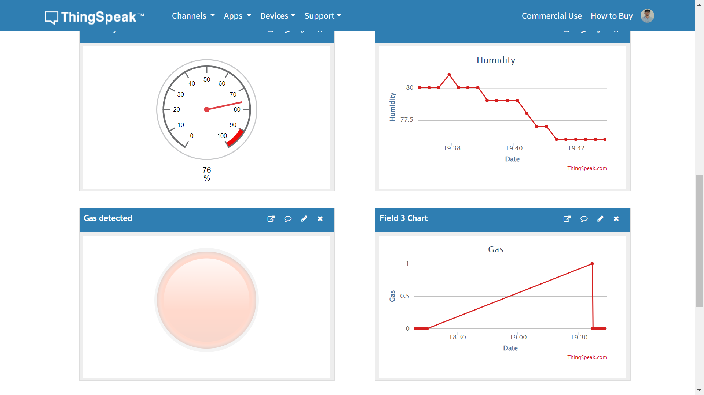

# 🌍 Air Pollution Monitoring System (IoT-Based)

## 📘 Overview  
This project presents a **real-time air pollution monitoring system** developed using an **ESP8266 microcontroller** integrated with **DHT11** and **MQ2** sensors. The system measures temperature, humidity, and gas concentration levels, displaying them on an OLED screen and uploading live data to **ThingSpeak** for cloud-based monitoring and analysis.

---

## ⚙️ Key Features  
- 🌡️ Real-time temperature and humidity tracking  
- 🧪 Gas detection and air quality measurement  
- 🖥️ Local OLED display for instant visualization  
- ☁️ ThingSpeak integration for remote data logging and graph generation  
- 🔌 Low-cost, low-power IoT architecture  

---

## 🧩 Components Used  
| Component | Description |
|------------|-------------|
| **ESP8266** | Wi-Fi-enabled microcontroller for IoT connectivity |
| **DHT11 Sensor** | Measures temperature and humidity |
| **MQ2 Sensor** | Detects gases like CO, LPG, and smoke |
| **SSD1306 OLED Display** | Displays real-time data readings |
| **ThingSpeak Cloud** | Stores and visualizes sensor data |
| **Libraries Used** | Adafruit SSD1306, DHT, WiFi, ThingSpeak |

---

## 🧠 Software Requirements  
- [**Arduino IDE**](https://www.arduino.cc/) – Used to program and upload code to the ESP8266  
- [**ThingSpeak**](https://thingspeak.com/) – Cloud IoT analytics platform for real-time data visualization  

> The Arduino IDE, combined with the required libraries, allows easy communication between the sensors, display, and cloud platform.

---

## 🧱 System Design  

  

The system continuously collects sensor readings, displays them locally, and sends them to the ThingSpeak cloud through Wi-Fi for live graphical visualization.

---

## ⚡ Setup Instructions  

### 🛠️ Hardware Connections
- Connect **DHT11** to **D4 (GPIO2)**  
- Connect **MQ2 analog output** to **A0**  
- Connect **SSD1306 OLED** via I2C (SDA, SCL)  
- Power the system via USB or a 5V supply  

### 💻 Software Setup
1. Install required libraries from Arduino Library Manager.  
2. Open the main source file: [`air_pollution_monitoring_system.ino`](Code/air_pollution_monitoring_system.ino)  
3. Configure your Wi-Fi credentials in the `setup()` section.  
4. Replace the `apiKey` and `channelNumber` with your own ThingSpeak details.  
5. Upload the code to the ESP8266 board and monitor the serial output.  

---

## 📊 ThingSpeak Cloud Visualization  
The system uploads data every 5 seconds to ThingSpeak, where it is visualized in real time.

  

---

## 🎯 Project Objective  
- The objective of this project is to design an IoT-based system capable of continuously **monitoring air quality** in targeted locations (e.g., homes, offices, industries, and public spaces).  
- It records environmental parameters and transmits data to a cloud platform for analysis, enabling users and authorities to make **informed decisions** about air quality and environmental safety.

---

## 💡 Future Scope  
- Integrate GPS for location-based pollution tracking  
- Add AI-based prediction of air quality index (AQI)  
- Use mobile app dashboards for visualization  
- Enable automatic ventilation or alert systems  
---

## 🏅 Acknowledgment  
This project was developed as part of an IoT-based embedded systems course, demonstrating real-world data acquisition, cloud integration, and sensor interfacing for environmental awareness.

---

### ✨ Developed by: **Vinay N**
